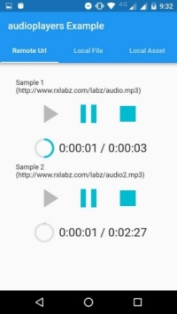
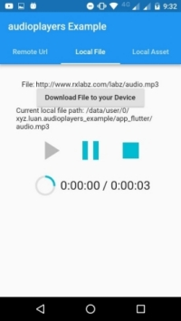
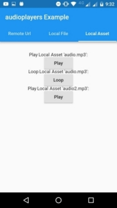

# AudioPlayers

A Flutter plugin to play multiple simultaneously audio files, works for Android and iOS.

  

## Install

This was orginally forked from [rxlabz's audioplayer](https://github.com/rxlabz/audioplayer), but the name was changed to `audioplayers` (mind the 's'); so, to add the dependency:

```yaml
dependencies:
  audioplayers: ^0.7.3
```

## Usage

An `AudioPlayer` instance can play a single audio at a time. To create it, simply call the constructor:

```dart
    AudioPlayer audioPlayer = new AudioPlayer();
```

You can create multiple instances to play audio simultaneously.

For all methods that return a `Future<int>`: that's the status of the operation. If `1`, the operation was successful. Otherwise it's the platform native error code.

Logs are disable by default! To debug, run:

```dart
  AudioPlayer.logEnabled = true;
```

### Playing Audio

There are three possible sources of audio:

 - Remote file on the Internet
 - Local file on the user's device
 - Local asset from your Flutter project

Both for Remote Files or Local Files, use the `play` method, just setting appropriately the flag `isLocal`.

For Local Assets, you have to use the `AudioCache` class (see below).

To play a Remote File, just call `play` with the url (the `isLocal` parameter is false by default):

```dart
  play() async {
    int result = await audioPlayer.play(url);
    if (result == 1) {
      // success
    }
  }
```

For a Local File, add the `isLocal` parameter:

```dart
  playLocal() async {
    int result = await audioPlayer.play(localPath, isLocal: true);
  }
```

The `isLocal` flag is required only because iOS makes a difference about it (Android doesn't care either way).

There is also an optional named `double volume` parameter, that defaults to `1.0`. It can go from `0.0` (mute) to `1.0` (max), varying linearly.

The volume can also be changed at any time using the `setVolume` method.

### Controlling

After playing, you can control the audio with pause, stop and seek commands.

Pause will pause the audio but keep the cursor where it was. Subsequently calling play will resume from this point.

```dart
  int result = await audioPlayer.pause();
```

Stop will stop the audio and reset the cursor. Subsequently calling play will resume from the beginning.

```dart
  int result = await audioPlayer.stop();
```

Finally, use seek to jump through your audio:

```dart
  int result = await audioPlayer.seek(new Duration(milliseconds: 1200));
```

Also, you can resume (like play, but without new parameters):

```dart
  int result = await audioPlayer.resume();
```

### Finer Control

By default, the player will be release once the playback is finished or the stop method is called.

This is because on Android, a MediaPlayer instance can be quite resource-heavy, and keep it unreleased would cause performance issues if you play lots of different audios.

On iOS this doesn't apply, so release does nothing.

You can change the Release Mode to determine the actual behavior of the MediaPlayer once finished/stopped. There are three options:

* RELEASE: default mode, will release after stop/completed.
* STOP: will never release; calling play should be faster.
* LOOP: will never release; after completed, it will start playing again on loop.

If you are not on RELEASE mode, you should call the release method yourself; for example:

```dart
  await audioPlayer.setUrl('clicking.mp3'); // prepare the player with this audio but do not start playing
  await audioPlayer.setReleaseMode(ReleaseMode.STOP); // set release mode so that it never releases

  // on button click
  await audioPlayer.resume(); // quickly plays the sound, will not release

  // on exiting screen
  await audioPlayer.release(); // manually release when no longer needed
```

Despite the complex state diagram of Android's MediaPlayer, an AudioPlayer instance should never have an invalid state. Even if it's released, if resume is called, the data will be fetch again.

### Handlers

You can register callbacks for several event handlers, like so:

#### Duration Handler

This handler returns the duration of the file, when it's available (it might take a while because it's being downloaded or buffered).

```dart
  player.durationHandler = (Duration d) {
    print('Max duration: $d');
    setState(() => duration = d);
  };
```

#### Position Handler

This handler updates the current position of the audio. You can use it to make a progress bar, for instance.

```dart
  player.positionHandler = (Duration  p) => {
    print('Current position: $d');
    setState(() => duration = d);
  };
```

#### Completion Handler

This handler is called when the audio finishes playing; it's used in the loop method, for instance.

It does not fire when you interrupt the audio with pause or stop.

```dart
  player.completionHandler = () {
    onComplete();
    setState(() {
      position = duration;
    });
  };
```

#### Error Handler

This is called when an unexpected error is thrown in the native code.

```dart
  player.errorHandler = (msg) {
    print('audioPlayer error : $msg');
    setState(() {
      playerState = PlayerState.stopped;
      duration = new Duration(seconds: 0);
      position = new Duration(seconds: 0);
    });
  };
```

### AudioCache

In order to play Local Assets, you must use the `AudioCache` class.

Flutter does not provide an easy way to play audio on your assets, but this class helps a lot. It actually copies the asset to a temporary folder in the device, where it is then played as a Local File.

It works as a cache because it keep track of the copied files so that you can replay then without delay.

You can find the full documentation for this class [here](doc/audio_cache.md).

## Supported Formats

You can check a list of supported formats below:

 - [Android](https://developer.android.com/guide/topics/media/media-formats.html)
 - [iOS](http://www.techotopia.com/index.php/Playing_Audio_on_iOS_8_using_AVAudioPlayer#Supported_Audio_Formats)

## :warning: iOS App Transport Security

By default iOS forbids loading from non-https url. To cancel this restriction you must edit your `.plist` and add:

```xml
<key>NSAppTransportSecurity</key>
<dict>
    <key>NSAllowsArbitraryLoads</key>
    <true/>
</dict>
```

## Credits

This was originally a fork of [rxlabz's audioplayer](https://github.com/rxlabz/audioplayer), but since we have diverged and added more features.

Thanks for @rxlabz for the amazing work!
